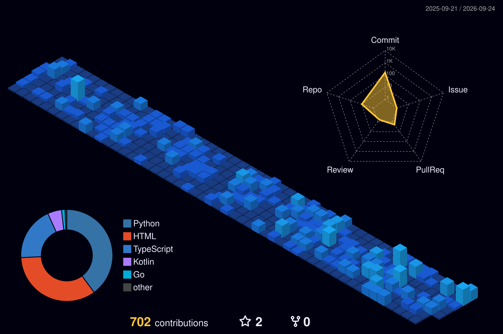

I build the whole path a request takes: the **Django / FastAPI** service that answers it, the **Next.js** app in front, the **BigQuery** pipelines behind, and the **Terraform, Caddy, CDN and WAF** that keep it standing. Currently doing that full-time in **iGaming**, on a product with landing pages in several languages and a data platform underneath.

Off the clock the scale drops and the standard doesn't: firmware that has to stay alive in 38 KB of heap, a C parser for a lab chromatograph, an Android app that watches my servers.

[**Telegram**](https://t.me/vita2841) · [**rosselsprung2841@gmail.com**](mailto:rosselsprung2841@gmail.com)

### Now

- **Content platforms** on Django + Wagtail: content models, StreamField blocks, data migrations between schemas, multi-language editing, per-role editor permissions.
- **SSR front-ends** on Next.js + TypeScript, tuned for Core Web Vitals — caching strategy, payload diets, AVIF/WebP.
- **Data pipelines** on GCP: Cloud Run + Scheduler + BigQuery, incremental MERGE, change-driven syncs to marketing platforms, CDC from MySQL.
- **The edge**: Terraform for DNS and CDN, Caddy with automatic TLS, WAF rules, zero-downtime hosting migrations.
- **AI-assisted development**: coding agents are part of my daily toolchain. I set the architecture, review every diff and own what ships.

### Selected work

**[esp8266-weather](https://github.com/v-2841/esp8266-weather)** — MicroPython · asyncio · I2C/OLED
Clock and weather firmware built to survive on its own: a supervisor restarts any failed task with exponential backoff, a hardware watchdog catches a stalled event loop, and safe mode offers three independent ways back in. Config is parsed as data, so a broken file can never brick the board.

**[game-buzzer](https://github.com/v-2841/game-buzzer)** — TypeScript · Socket.IO · React · Vitest
Real-time "who pressed first" game. Each client's clock is synchronised against the server, so the winner is decided by honest press time rather than by whose packet arrived first.

**[alcobottle](https://github.com/v-2841/alcobottle)** — Django 6 · DRF · Next.js 16 · PostgreSQL · Docker
Spirits catalogue: a filterable REST API, an SSR storefront that generates its own SEO pages, one Caddy in front of both, and a Telegram alert on every server error.

**[backups](https://github.com/v-2841/backups)** — Python (stdlib) · SSH · pg_dump · systemd
Backup orchestrator for my servers. Pulls files, live SQLite databases and Postgres dumps over SSH into dated snapshots with a manifest, then rotates them.

**[ratio_checker](https://github.com/v-2841/ratio_checker)** — C · WinAPI · MinGW
Windows desktop tool that parses gas chromatograph exports, extracts fatty-acid peak areas and checks five ratios against GOST 32261 — the test that reveals vegetable fat hiding in butter.

**[Vita](https://github.com/v-2841/Vita)** — Kotlin · Jetpack Compose · AndroidKeyStore
Android app that watches my VPS and the VPN panel on it: CPU, RAM, disk and traffic, plus every client with its transfer, current speed and last time seen online. Credentials never leave the device unencrypted — they are sealed with AES-GCM in the Android KeyStore.

**[daystat](https://github.com/v-2841/daystat)** — Django · Tailwind 4 · Chart.js · Docker
Personal tracker for weight, calories and spending: a hand-written server-side calendar with forecasts, smoothed charts and weekly summaries. Tailwind builds without Node, fonts are self-hosted, and the whole thing scores 96+ on Lighthouse.

**[laboratory](https://github.com/v-2841/laboratory)** — Django · DRF · PostgreSQL · openpyxl
Internal service for the chemical lab I worked in: reagent stock and expiry tracking, test requests, standards and regulatory documents, role-based access, and xlsx exports onto the lab's own templates. Web app, REST API, Telegram bot and an Android client.

**[neptune4-telegram-bot](https://github.com/v-2841/neptune4-telegram-bot)** — Python · aiohttp · asyncssh · Klipper
Telegram remote for a 3D printer over Moonraker: live print state, temperatures, camera stills, progress alerts, remote power cycling.

**[samsung-health-export](https://github.com/v-2841/samsung-health-export)** — Python (stdlib)
Turns a Samsung Health export into one self-describing JSON file a doctor can actually read — units legend, coverage manifest, clinical grouping.

### Stack

- **Languages** — Python · TypeScript · Kotlin · C · Bash · SQL · HCL
- **Backend** — Django · DRF · Wagtail · FastAPI · Flask · Celery · gunicorn
- **Front-end** — Next.js · React · Tailwind · Vite · Playwright
- **Data** — BigQuery · PostgreSQL · MySQL · Redis · dbt · Datastream CDC · GA4
- **Cloud & infra** — GCP (Cloud Run · Compute Engine · IAM/WIF · Secret Manager) · Docker · Terraform · GitHub Actions · Caddy · nginx · CDN & WAF
- **Embedded & mobile** — MicroPython on ESP8266 · Android (Kotlin, Jetpack Compose) · Armbian · Klipper

<!-- STATS:START -->
```text
Python       ██████████████████░░░░░░ 73.4%
TypeScript   ██░░░░░░░░░░░░░░░░░░░░░░ 10.2%
Kotlin       ██░░░░░░░░░░░░░░░░░░░░░░  9.1%
Shell        █░░░░░░░░░░░░░░░░░░░░░░░  2.8%
C            ░░░░░░░░░░░░░░░░░░░░░░░░  1.9%
JavaScript   ░░░░░░░░░░░░░░░░░░░░░░░░  1.8%
last public push  1m ago
```
<!-- STATS:END -->

<!-- ACTIVITY:START -->
| repository | latest commit | |
|---|---|---|
| [laboratory](https://github.com/v-2841/laboratory) | Use parameterized query in reagent search | 6m ago |
| [backups](https://github.com/v-2841/backups) | Add live progress output and keep\_min\_backups retention guard | 1d ago |
| [esp8266-weather](https://github.com/v-2841/esp8266-weather) | Make safe mode escapable from the button, blank the screen on refresh | 6d ago |
| [alcobottle](https://github.com/v-2841/alcobottle) | Update frontend dependencies | 6d ago |
| [Vita](https://github.com/v-2841/Vita) | Vita 1.0.5: stable alphabetical order for online clients | 7d ago |
<!-- ACTIVITY:END -->

<picture>
  <source media="(prefers-color-scheme: dark)" srcset="https://raw.githubusercontent.com/v-2841/v-2841/output/snake-dark.svg">
  <source media="(prefers-color-scheme: light)" srcset="https://raw.githubusercontent.com/v-2841/v-2841/output/snake-light.svg">
  
</picture>

<details>
<summary><b>More numbers</b></summary>
<br>

<picture>
  <source media="(prefers-color-scheme: dark)" srcset="./profile-summary-card-output/github_dark/0-profile-details.svg">
  
</picture>

<picture>
  <source media="(prefers-color-scheme: dark)" srcset="./profile-summary-card-output/github_dark/3-stats.svg">
  
</picture>
<picture>
  <source media="(prefers-color-scheme: dark)" srcset="./profile-summary-card-output/github_dark/4-productive-time.svg">
  
</picture>



</details>

<details>
<summary><b>More projects</b></summary>
<br>

- **[shells](https://github.com/v-2841/shells)** — Fedora tooling: an installer for the fish shell, plus an interactive TUI that builds Caddy with the plugins I need.
- **[qr_stand](https://github.com/v-2841/qr_stand)** — generates a 3D-printable stand with your Wi-Fi QR code baked into the geometry, straight to STL.
- **[tapo_socket_charging](https://github.com/v-2841/tapo_socket_charging)** — keeps a laptop battery in the 40-60% band by switching the smart socket its charger sits in.

</details>
